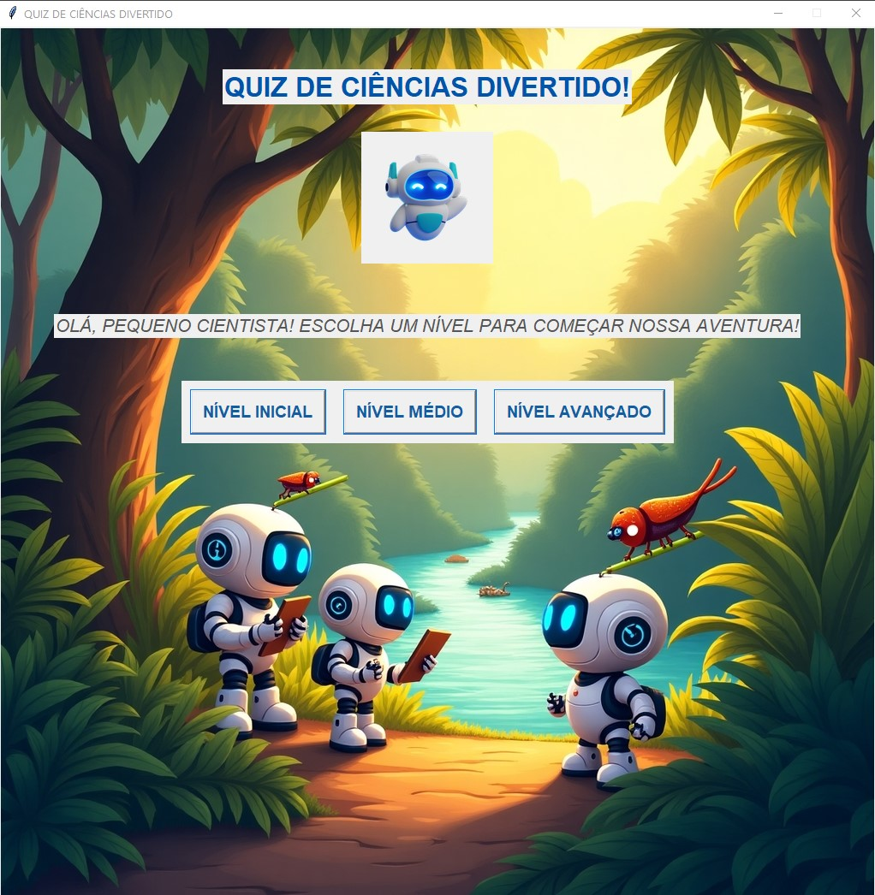
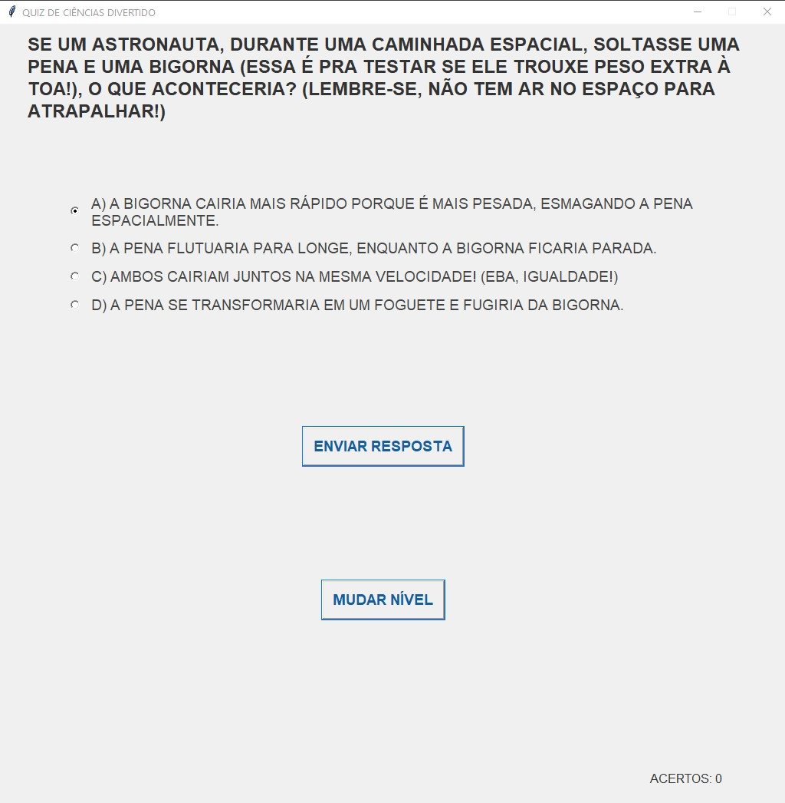

# 🤖🧠 Quiz de Ciências com I.A. 🔬✨

Um quiz de ciências divertido e interativo, desenvolvido em Python com Tkinter, que leva crianças (e adultos!) a uma jornada de aprendizado. Este projeto inovador utiliza **Inteligência Artificial (Google Gemini)** para a **geração dinâmica de perguntas e alternativas**, garantindo conteúdo sempre novo. A IA também atua como **agente de curadoria** de perguntas e **agente de avaliação**, oferecendo feedback inteligente e dicas personalizadas. Prepare-se para testar seus conhecimentos e descobrir curiosidades científicas com a ajuda da IA!

---

## 🚀 Funcionalidades Principais

* **Geração Dinâmica de Perguntas:** A IA cria perguntas originais e diversas a cada nova rodada.
* **Alternativas Inteligentes:** As opções de resposta também são geradas pela IA, incluindo distratores plausíveis.
* **Agente de Curadoria:** A IA ajuda a garantir a qualidade e relevância das perguntas.
* **Agente de Avaliação e Feedback:** Receba feedback instantâneo e dicas personalizadas com base em suas respostas.
* **Interface Amigável:** Desenvolvido com Tkinter para uma experiência de usuário simples e intuitiva.

---

## 📸 Capturas de Tela


*(A tela principal do jogo, mostrando o menu ou a primeira pergunta.)*


*(Um exemplo de como as perguntas e opções são apresentadas.)*


*(Mostrando o feedback da IA após uma resposta.)*

---

## ⚙️ Tecnologias Utilizadas

* **Python 3.13:** Linguagem de programação principal.
* **Tkinter:** Biblioteca padrão do Python para desenvolvimento de interfaces gráficas.
* **Google Gemini API:** Utilizada para as funcionalidades de Inteligência Artificial.
* **PyInstaller:** Ferramenta para empacotar o aplicativo em um executável.

---

## 📦 Como Executar o Quiz

### Opção 1: Baixe o Aplicativo Executável (Recomendado para usuários)

A versão compilada do quiz para Windows (formato `.exe`) já está disponível! Você pode executar o programa diretamente, sem precisar instalar Python ou suas dependências.

**Para baixar a última versão, visite nossa página de [Releases aqui!](https://github.com/suellencna/Quiz_Ciencias_com_IA/releases/tag/v1.0.0)**

**Instruções:**
1.  Acesse a página de Releases clicando no link acima.
2.  Na seção do lançamento (`v1.0.0` ou a mais recente), localize e baixe o arquivo `Jogo.exe` na área de "Assets".
3.  Execute o `Jogo.exe` no seu computador Windows.

### Opção 2: Execute do Código-Fonte (Para Desenvolvedores)

Se você é um desenvolvedor Python e deseja explorar o código ou fazer modificações:

1.  **Clone o repositório:**
    ```bash
    git clone [https://github.com/suellencna/Quiz_Ciencias_com_IA.git](https://github.com/suellencna/Quiz_Ciencias_com_IA.git)
    ```
2.  **Navegue até a pasta do projeto:**
    ```bash
    cd Quiz_Ciencias_com_IA
    ```
3.  **Crie e ative um ambiente virtual (altamente recomendado):**
    ```bash
    python -m venv venv
    # No Windows:
    .\venv\Scripts\activate
    # No macOS/Linux:
    source venv/bin/activate
    ```
4.  **Instale as dependências:**
    ```bash
    pip install -r requirements.txt
    ```
    *(**Nota:** Você precisará gerar o `requirements.txt` rodando `pip freeze > requirements.txt` no seu ambiente Python que contém as bibliotecas do quiz.)*

5.  **Execute o jogo:**
    ```bash
    python Jogo.py
    ```

---

## 🤝 Contribuições

Contribuições são bem-vindas! Sinta-se à vontade para abrir issues para reportar bugs, sugerir novas funcionalidades ou enviar pull requests.

---

## 📄 Licença

Este projeto está licenciado sob a Licença MIT. Consulte o arquivo [LICENSE](LICENSE) para mais detalhes.

---

## 👩‍💻 Autor

Desenvolvido por Suellen Andrade Pinto.

* [Seu Perfil no GitHub](https://github.com/suellencna)
* [Seu LinkedIn (Opcional)](https://www.linkedin.com/in/suellen-andrade-pinto-b63751a6/)
